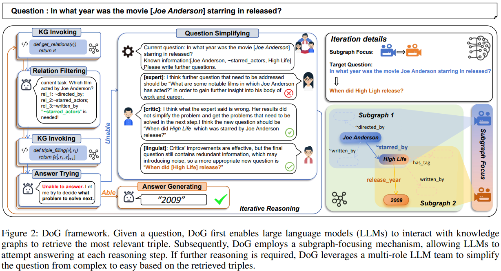

# :dog:Debate on Graph: a Flexible and Reliable Reasoning Framework for Large Language Models

## :telescope:The framework of DoG



## :mag_right:Project Structure

```bash
├─agentverse
│  ├─...
│  └─tasks
│      └─kgqa
│          ├─freebase
│          │  └─three_role_one_turn_sequential_freebase
│          └─metaqa
│              └─three_role_one_turn_sequential_metaqa
├─eval_helper
│	└─get_evaluation.py
├─KBQA_TASK
│   ├─freebase
│   │	├─dataset
│   │	│	├─cwq.json
│   │	│	├─grailqa.json
│   │	│	├─WebQSP.json
│   │	│	└─WebQuestions.json
│   │   ├─freebase_func.py
│   │   ├─main_cwq.py
│   │   ├─main_grailqa.py
│   │   ├─main_webqsp.py
│   │	├─main_webquestions.py
│   │   └─prompt_list.py
│   └─metaqa
│       ├─dataset
│       ├─prompt_list.py
│       ├─metaqa_func.py
│       ├─main_metaqa_1hop.py
│       ├─main_metaqa_2hop.py
│       └─main_metaqa_3hop.py
└─requirements.txt
```

## 🚀Getting Started

### 0. Requirements

```bash
pip install -r requirements.txt
```

If you want to call OpenAI's API, you also need to export your OpenAI key as follows before running our code.

1. **Using Environment Variable:**

```bash
export OPENAI_API_KEY="your_api_key_here"
```

2. **Or, directly specifying in the Python file:**

```python
import os
os.environ["OPENAI_API_KEY"] = "your_api_key_here"
```

What's more, DoG also supports the use of local open-source large language models.

```python
import os
os.environ["OPENAI_API_BASE"] = "your_api_base_here"
```

Additionally, we recommend deploying the Virtuoso server locally by [the instruction](https://github.com/dki-lab/Freebase-Setup).

### 1. Datasets

We select five public datasets to evaluate the reasoning ability over knowledge graphs: MetaQA, WebQSP, CWQ,WebQuestions, and GrailQA. You can get them directly from `dataset` folder. 

### 2. Experiment

- MetaQA

```bash
 python main_metaqa_1hop.py --task "kgqa/metaqa/three_role_one_turn_sequential_metaqa" --output_path "./output/metaqa_1hop_output.txt"
   
 python main_metaqa_2hop.py --task "kgqa/metaqa/three_role_one_turn_sequential_metaqa" --output_path "./output/metaqa_2hop_output.txt"
   
 python main_metaqa_3hop.py --task "kgqa/metaqa/three_role_one_turn_sequential_metaqa" --output_path "./output/metaqa_3hop_output.txt"
```

- CWQ

```bash
 python main_cwq.py --task "kgqa/freebase/three_role_one_turn_sequential_freebase" --output_path "./output/cwq_output.txt"
```

- GrailQA

```bash
 python main_grailqa.py --task "kgqa/freebase/three_role_one_turn_sequential_freebase" --output_path "./output/grailqa_output.txt"
```

- WebQSP

```bash
 python main_webqsp.py --task "kgqa/freebase/three_role_one_turn_sequential_freebase" --output_path "./output/webqsp_output.txt"
```

- WebQuestions

```bash
python main_webquestions.py --task "kgqa/freebase/three_role_one_turn_sequential_freebase" --output_path "./output/webquestions_output.txt"
```

Feel free to modify the YAML files under `agentverse\tasks\kgqa\freebase ` to change the strategy for **Question Simplifying**. We provide basic prompt and encourage exploring more interesting and efficient debate strategies.

## :heart:Acknowledgments

This repository builds the multi-agent debate team based on the following paper and code:

- Chan et al., "ChatEval: Towards Better LLM-based Evaluators through Multi-Agent Debate," 2023  [[Paper Link](https://arxiv.org/abs/2308.07201)] [[Repo Link](https://github.com/thunlp/ChatEval)]

Thanks for their nice contribution.

## :bookmark_tabs: Citation

```bibtex
@article{dog2024,
  title={Debate on Graph: a Flexible and Reliable Reasoning Framework for Large Language Models},
  author={Jie Ma, Zhitao Gao, Qi Chai, Wangchun Sun, Pinghui Wang, Hongbin Pei, Jing Tao, Lingyun Song, Jun Liu, Chen Zhang, and Lizhen Cui},
  journal={arXiv preprint arXiv:2409.03155},
  year={2024}
}


